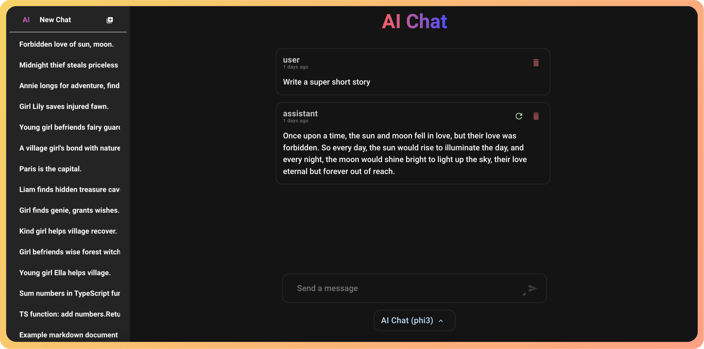
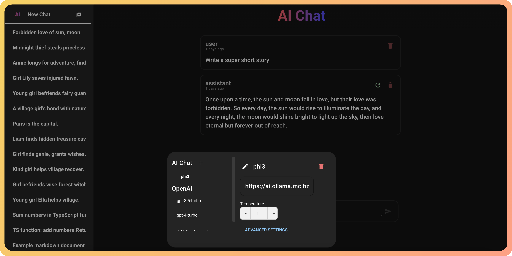

# AI Chat (aichat)

A chat interface for OpenAI and Ollama models featuring chat streaming, local caching, and customisable model values.
<br>
OpenAI models utilise an OpenAI developer key which allows you to pay per token.
<br>
Check out the demo [here](https://ai.chat.mc.hzuccon.com/#/)

## Features
 - Code highlighting on input and reponse
 - LLAVA model support (vision models)
 - Completely local. All your converations are stored on your browser, not on some server
 - Custom model settings
 - PWA for lightweight installation on mobile and desktop

## Screenshots




## To do
- Fix multiple root elements in template (src/components/ChatMessage/ChatmessageChunk.vue)
- Explore continue prompt (src/components/ChatMessage/ChatMessage.vue)

## Install the dependencies
```bash
yarn
# or
npm install
```

### Start the app in development mode (hot-code reloading, error reporting, etc.)
The service can be launched in `dev` mode and is accessable at `http://localhost:9200/#/`
```bash
quasar dev
```
In `dev` mode, the `HMR_PORT` environment variable can be set to allow for Hot_Module_Reloading when the service is sitting behind a sub/domain.
```
environment:
    - HMR_PORT=443
```


### Lint the files
```bash
yarn lint
# or
npm run lint
```


### Format the files
```bash
yarn format
# or
npm run format
```


### Build the app for production
```bash
quasar build
```

### Customize the configuration
See [Configuring quasar.config.js](https://v2.quasar.dev/quasar-cli-vite/quasar-config-js).
